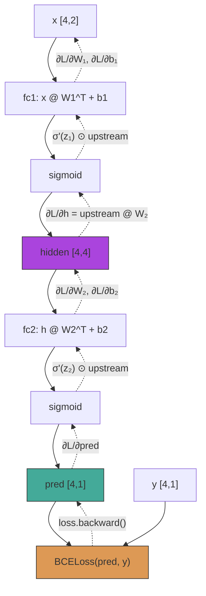

# `01_pytorch_fundamentals.py` — Tensors, Autograd, and Training Loops Explained

## 1. Executive Overview

`01_pytorch_fundamentals.py` is a **three-part PyTorch fundamentals lesson** that bridges the learner from hand-coded NumPy backpropagation (`nn_toy.py`) into the PyTorch framework. The file delivers:

| Part | Content | PyTorch Concept Introduced |
|------|---------|---------------------------|
| 0 | Device detection (CUDA/MPS/CPU) | Hardware-aware tensor placement |
| 1 | Tensor creation, autograd verification, shape operations | `torch.Tensor`, `.backward()`, `.view()` vs `.reshape()`, contiguity |
| 2 | XOR classification in PyTorch | `nn.Module`, `nn.Linear`, `nn.BCELoss`, `torch.optim.SGD`, 5-step training loop |
| 3 | Credit risk default prediction (3-layer MLP) | `BatchNorm1d`, `Dropout`, `AdamW`, cosine annealing, `DataLoader`, gradient clipping, checkpointing, hook-based activation inspection |

The pedagogical strategy is deliberate: Part 2 deliberately replicates `nn_toy.py` architecture and initialization so the learner sees the **exact same math** executed through PyTorch's automatic differentiation instead of 50+ lines of manual chain-rule code. Part 3 then graduates to a realistic finance problem with proper ML engineering practices (batch norm, dropout, learning rate scheduling, gradient clipping, checkpointing) that a NumPy implementation would be too cumbersome to write.

---

## 2. Key Concepts & Mathematics

### 2.1 PyTorch Autograd: Dynamic Computation Graphs

**What it is:** Every operation on a tensor with `requires_grad=True` is recorded as a node in a Directed Acyclic Graph (DAG). When `.backward()` is called on a scalar, PyTorch walks the graph in reverse topological order, applying the chain rule at each node.

**Why it matters:** In `nn_toy.py`, you derived every gradient by hand:

```python
# nn_toy.py — MANUAL gradient for output layer
d_output_z = (cache.prediction - y_true) / n_samples
d_w2 = cache.hidden_a.T @ d_output_z
d_b2 = np.sum(d_output_z, axis=0, keepdims=True)
```

In PyTorch, the same computation is:

```python
loss.backward()  # that's it — all gradients populate .grad fields
```

**The computation graph for XOR:**

```
x [4,2] ──┬──→ fc1 [4,2]@W1^T[2,4]+b1[4] ──→ sigmoid ──→ hidden [4,4]
           │                                                    │
           │                                              fc2: hidden@W2^T[4,1]+b2[1]
           │                                                    │
           │                                               sigmoid ──→ pred [4,1]
           │                                                    │
           └──────────── y_true [4,1] ──→ BCELoss ←────────────┘
                                                    │
                                               loss (scalar)
```

When `loss.backward()` is called:

1. The graph is traversed **backward** (loss → pred → sigmoid → fc2 → hidden → sigmoid → fc1 → x).
2. At each node, the local gradient is computed and multiplied by the incoming upstream gradient (chain rule).
3. The result is accumulated into `.grad` for each leaf tensor with `requires_grad=True` (i.e., the `nn.Parameter` objects inside `nn.Linear`).

**Key detail — gradient accumulation, not replacement:**

```python
optimizer.zero_grad()   # ① MUST zero before each step
loss.backward()         # ② ADD gradients to .grad
optimizer.step()        # ③ use .grad for update
```

If `zero_grad()` is omitted, `.backward()` **adds** the new gradient to the existing `.grad` value. This is intentional — it enables **gradient accumulation** across multiple forward passes (useful when the model is too large for the desired batch size). Forgetting `zero_grad()` is the #1 beginner bug.

### 2.2 `nn.Linear` Internals and Weight Convention

`nn.Linear(in_features, out_features)` stores its weight as a **`[out_features, in_features]`** matrix. The forward pass computes:

$$y = x W^T + b$$

where $x$ is `[N, in_features]`, $W^T$ is `[in_features, out_features]`, and $b$ is `[out_features]`.

This is the **opposite convention** from `nn_toy.py`, where you stored weights as `[in_features, out_features]` and computed `x @ W`. The difference is internal to PyTorch — the important thing is to understand shape errors:

```python
# nn_toy.py convention: W shape = [in, out]
self.w1.shape   # (2, 4)
z1 = x @ self.w1  # [4, 2] @ [2, 4] → [4, 4]  ✓

# PyTorch convention: W shape = [out, in]
self.fc1.weight.shape   # (4, 2)
z1 = self.fc1(x)        # internally: x @ W^T → [4, 2] @ [2, 4] → [4, 4]  ✓
```

### 2.3 BCEWithLogitsLoss vs BCELoss — the Numerical Stability Lesson

**BCELoss** expects input already passed through sigmoid:
$$\mathcal{L} = -\frac{1}{N}\sum \left[y\log(\sigma(z)) + (1-y)\log(1-\sigma(z))\right]$$

**BCEWithLogitsLoss** takes raw logits and fuses sigmoid + BCE into one operation:
$$\mathcal{L} = -\frac{1}{N}\sum \left[y\log\left(\frac{1}{1+e^{-z}}\right) + (1-y)\log\left(\frac{e^{-z}}{1+e^{-z}}\right)\right]$$

But the PyTorch implementation uses the **log-sum-exp trick** for numerical stability:
$$\mathcal{L} = \frac{1}{N}\sum \left[\max(z,0) - z\cdot y + \log(1 + e^{-|z|})\right]$$

This avoids computing $\log(\text{very small number})$ when $z$ is a large negative number (which would produce $\sigma(z) \approx 0$ and $\log(0) \to -\infty$).

**The gradient is the same simplified form you learned:**
$$\frac{\partial \mathcal{L}}{\partial z} = \frac{\sigma(z) - y}{N}$$

Part 2 deliberately uses `BCELoss` to match `nn_toy.py` exactly. Part 3 uses `BCEWithLogitsLoss` as the production-correct choice. **Rule of thumb: always use `BCEWithLogitsLoss` for binary classification.**

### 2.4 BatchNorm1d — What, Why, and Where

For a batch of activations $x \in \mathbb{R}^{B \times C}$ (batch size $B$, channels $C$):

$$\hat{x}_i = \frac{x_i - \mu_B}{\sqrt{\sigma_B^2 + \epsilon}} \quad \text{(normalize to zero mean, unit variance)}$$
$$y_i = \gamma \hat{x}_i + \beta \quad \text{(learnable scale and shift)}$$

where $\mu_B = \frac{1}{B}\sum x_i$ and $\sigma_B^2 = \frac{1}{B}\sum (x_i - \mu_B)^2$.

**Why it works:**
1. **Reduces internal covariate shift** — each layer sees inputs with stable statistics, so later layers don't need to constantly adapt to shifting distributions from earlier layers.
2. **Enables higher learning rates** — without batchnorm, large LRs can cause activations to explode/saturate. Batchnorm normalizes them back.
3. **Acts as a light regularizer** — the mean/variance computed on each mini-batch adds noise, similar to dropout.

**Placement rule:** `Linear → BatchNorm → Activation` (batchnorm before the activation). This is the modern convention used in ResNet and most architectures. The older convention (`Linear → Activation → BatchNorm`) is still seen but generally performs worse because you're normalizing already-nonlinear outputs.

### 2.5 Dropout — Cheap Ensemble Regularization

During training, each neuron is independently "dropped" with probability $p$ (set to 0):

$$a_i^{\text{dropout}} = \begin{cases} 0 & \text{with probability } p \\ \frac{a_i}{1-p} & \text{with probability } 1-p \end{cases}$$

The **$\frac{1}{1-p}$ scaling** is critical: it keeps the expected value of activations unchanged between train and test time:
$$\mathbb{E}[a_i^{\text{dropout}}] = (1-p) \cdot \frac{\mathbb{E}[a_i]}{1-p} + p \cdot 0 = \mathbb{E}[a_i]$$

During evaluation (`model.eval()`), dropout is disabled entirely — no scaling needed.

**Intuition for finance data:** With 15% defaults and 85% non-defaults, the model can easily memorize the majority class. Dropout forces each neuron to be useful independently, preventing co-adaptation where neuron A only fires when neuron B already fired.

### 2.6 AdamW — Decoupled Weight Decay

Standard Adam with L2 regularization adds $\lambda\|\theta\|^2$ to the loss, which couples weight decay with the adaptive learning rates:
$$\theta_{t+1} = \theta_t - \eta \frac{m_t}{\sqrt{v_t} + \epsilon} - \eta\lambda\theta_t$$

Notice the weight decay term $\eta\lambda\theta_t$ is scaled by the adaptive step size — this means parameters with small gradients get less regularization, which is counterproductive.

**AdamW** decouples weight decay from the adaptive update:
$$\theta_{t+1} = \theta_t - \eta \frac{m_t}{\sqrt{v_t} + \epsilon} - \eta\lambda\theta_t$$

Wait — the formula looks identical. The difference is subtle but important: in AdamW, weight decay is applied **directly to the parameters**, not through the gradient. This means the regularization is uniform across all parameters regardless of their gradient history, which improves generalization. Every Transformer paper since 2018 uses AdamW.

### 2.7 Cosine Annealing LR Schedule

$$\eta_t = \eta_{\min} + \frac{1}{2}(\eta_{\max} - \eta_{\min})\left(1 + \cos\left(\frac{t}{T_{\max}}\pi\right)\right)$$

The learning rate follows a cosine curve from $\eta_{\max}$ to $\eta_{\min}$ over $T_{\max}$ epochs. This is preferred over step decay because:
- Early epochs: high LR for fast progress
- Middle epochs: moderate LR for refinement
- Late epochs: near-zero LR for fine convergence
- No sharp drops that can destabilize training

---

## 3. Step-by-Step Code Walkthrough

### 3.0 Device Detection

```python
if torch.cuda.is_available():
    DEVICE = torch.device("cuda")
elif torch.backends.mps.is_available():
    DEVICE = torch.device("mps")
else:
    DEVICE = torch.device("cpu")
```

**What it does:** Detects available GPU hardware using a priority chain: NVIDIA CUDA → Apple Metal (MPS) → CPU fallback. This is a one-time configuration block that every PyTorch script should include.

**Tensor shape significance:** None yet — this sets where future tensors will live. Tensors must reside on the same device to interact (you can't multiply a CPU tensor with a GPU tensor).

**Cross-reference to `nn_toy.py`:** `nn_toy.py` is CPU-only (NumPy has no GPU support). This device abstraction is one of PyTorch's core advantages — write once, run on any hardware.

### 3.1a Tensor Creation and NumPy Interop

```python
a = torch.tensor([[1.0, 2.0], [3.0, 4.0]], requires_grad=False)
b = torch.randn(2, 2)  # same as np.random.randn

np_arr = np.array([[5.0, 6.0], [7.0, 8.0]])
t_from_np = torch.from_numpy(np_arr)
np_back = t_from_np.numpy()
print(f"NumPy -> Tensor (same memory): {np_arr.ctypes.data == t_from_np.data_ptr()}")
```

**What it does:** Creates tensors and demonstrates NumPy memory sharing. `torch.from_numpy()` creates a tensor that **shares the same underlying memory buffer** with the NumPy array — modifying one modifies the other. This is a performance optimization: no copy occurs, so it's effectively free.

**When memory is NOT shared:** If the NumPy array and tensor are on different devices (CPU vs GPU), or if the tensor requires gradient tracking — then a copy is forced.

**What `requires_grad=False` means:** The tensor does NOT participate in autograd. By default, all tensors have `requires_grad=False`. Only parameters and inputs you explicitly enable will track gradients.

### 3.1b Autograd Verification

```python
x = torch.tensor([2.0, 3.0], requires_grad=True)
y = x[0] ** 2 + 3 * x[0] * x[1] + x[1] ** 2  # f(x0, x1) = x0² + 3x0x1 + x1²
y.backward()
```

**What it does — the computation graph:**

```
x0 [scalar, grad=True] ──→ pow(2) ──→ x0² ──┐
                          │                   ├──→ + ──→ y
x1 [scalar, grad=True] ──→ ┬ pow(2) ──→ x1² ─┘
                           │
                           └──→ mul ──→ 3x0x1 ──┘
                               /
                 [scalar 3] ──┘
```

**The gradient computed by autograd:**
$$\frac{\partial y}{\partial x_0} = 2x_0 + 3x_1 = 4 + 9 = 13$$
$$\frac{\partial y}{\partial x_1} = 3x_0 + 2x_1 = 6 + 6 = 12$$

```python
print(f"dy/dx (autograd): {x.grad.numpy()}")  # [13., 12.]
```

**What `.detach()` does:** Creates a new tensor that shares data but is detached from the computation graph. `x.detach().numpy()` is the safe way to extract a NumPy array — without detaching, you'd get an error because numpy doesn't understand autograd graphs.

**What `.item()` does:** Extracts a Python float from a 0-dimensional (scalar) tensor. `y.item()` returns `31.0` directly.

### 3.1c Shape Operations and the Contiguity Trap

```python
t = torch.randn(4, 8, 16)
t.permute(2, 0, 1).view(32, 16)  # CRASHES
```

**What happens:** `permute(2, 0, 1)` rearranges the axes of `[4, 8, 16]` to `[16, 4, 8]`. This is a **view operation** — no data is copied, only the stride metadata is changed. In memory, the data is still laid out as `[4, 8, 16]`. After permuting, the strides become `[1, 16, 128]` instead of `[128, 16, 1]`, meaning the tensor is **non-contiguous**. `.view()` requires contiguous memory because it reinterprets the flat buffer — it fails with:

```
RuntimeError: view size is not compatible with input tensor's size and stride
```

**The fix:**
```python
t.permute(2, 0, 1).contiguous().view(32, 16)  # copy first, then view
t.permute(2, 0, 1).reshape(32, 16)             # reshape copies if needed
```

**Memory layout visualization:**

```
Original [4, 8, 16] — contiguous in memory:
[0,0,0] [0,0,1] ... [0,0,15] [0,1,0] ... [3,7,15]
│←──── stride 16 ────→│← stride 128 ───────────────────→│

After permute(2, 0, 1) — same memory, different strides:
Reading order becomes: [0,0,0] [1,0,0] [2,0,0] [3,0,0] ...
Strides: [1, 16, 128] — elements are no longer adjacent in memory!
```

**Rule:** Use `.reshape()` when you're unsure — it always works. Use `.view()` only when you know the tensor is contiguous and you want the performance guarantee (no copy).

### 3.2 XORModel — nn.Module Architecture

```python
class XORModel(nn.Module):
    def __init__(self) -> None:
        super().__init__()
        self.fc1 = nn.Linear(2, 4)
        self.fc2 = nn.Linear(4, 1)

        with torch.no_grad():
            nn.init.normal_(self.fc1.weight, mean=0.0, std=0.5)
            nn.init.zeros_(self.fc1.bias)
```

**What `nn.Module` provides:**

| Feature | What it does |
|---------|-------------|
| `model.parameters()` | Returns iterator over all trainable parameters (weights, biases) |
| `model.to(device)` | Moves all parameters and buffers to the specified device |
| `model.state_dict()` | Returns `OrderedDict` of parameter values (for checkpointing) |
| `model.load_state_dict(d)` | Restores parameters from a state dict |
| `model.train()` / `.eval()` | Controls behavior of Dropout, BatchNorm, etc. |
| `model.zero_grad()` | Zeros gradients for all parameters |

**What `super().__init__()` does:** Registers the module with PyTorch's internal tracking system. Without it, parameters inside `nn.Linear` won't be found by `model.parameters()`.

**What `with torch.no_grad():` does:** Disables gradient tracking for the code inside the block. Weight initialization is a manual operation — you don't want to track gradients of the initialization itself. This also saves memory by not building a computation graph.

**What `nn.init.normal_(...)` does:** The trailing underscore `_` means "in-place operation" — it modifies the tensor directly. `nn.init.normal_` fills the weight tensor with samples from $\mathcal{N}(0, 0.5)$, matching the initialization in `nn_toy.py`:

```python
# nn_toy.py — same initialization, different API
self.w1 = rng.normal(loc=0.0, scale=0.5, size=(2, 4))
```

### 3.2 (continued) — The 5-Step Training Loop

```python
for epoch in range(1, 8001):
    optimizer.zero_grad()       # Step ①
    pred = model(x)             # Step ②
    loss = criterion(pred, y)   # Step ③
    loss.backward()             # Step ④
    optimizer.step()            # Step ⑤
```

**Step-by-step memory and computation flow:**

| Step | What happens | Memory state |
|------|-------------|-------------|
| ① `zero_grad()` | Sets `fc1.weight.grad = 0`, `fc1.bias.grad = 0`, etc. | All `.grad` = None or zero |
| ② `model(x)` | `x [4,2] → fc1 → sigmoid → fc2 → sigmoid → pred [4,1]` | Computation graph built; intermediate activations held for backward |
| ③ `criterion(pred, y)` | `BCELoss(pred, y) → scalar_tensor` | Graph extended; loss node added |
| ④ `loss.backward()` | Walks graph backward: `∂L/∂pred → ∂L/∂fc2 → ∂L/∂hidden → ∂L/∂fc1` | All `.grad` fields populated with ∂L/∂param |
| ⑤ `optimizer.step()` | For each param: `p -= lr * p.grad` (for SGD) | Parameters updated; computation graph freed |

**Why `torch.no_grad()` during inference:**

```python
with torch.no_grad():
    print(model(x).round(decimals=3))
```

Disables gradient tracking — no computation graph is built, no intermediate activations are saved for backward. This reduces memory usage by ~2-3x for inference. `model.eval()` + `torch.no_grad()` is the standard pair for evaluation.

### 3.3 generate_credit_data — Synthetic Data Engineering

```python
def generate_credit_data(n_samples=10_000, seed=42):
    rng = np.random.default_rng(seed)
    n_default = int(n_samples * 0.15)
    n_good = n_samples - n_default
```

**Design rationale:** Uses `np.random` (not `torch.rand`) because we need `rng.poisson()` for count features (inquiries, delinquencies). PyTorch doesn't have Poisson sampling built-in. The data is generated in NumPy, then converted to PyTorch tensors.

**Feature distributions — why they differ between classes:**

| Feature | Good (mean) | Default (mean) | Why this gap |
|---------|------------|----------------|-------------|
| FICO | 0.70 | 0.45 | Credit score: higher = better |
| DTI | 0.30 | 0.55 | Debt-to-income: lower = safer |
| LTV | 0.50 | 0.75 | Loan-to-value: higher = riskier |
| Inquiries | 1 (poisson) | 3 (poisson) | More inquiries = credit shopping |
| History | 10 yrs | 4 yrs | Longer history = more data |
| Delinquencies | 0.5 (poisson) | 2 (poisson) | More late payments = riskier |
| Utilization | 0.30 | 0.65 | High credit use = financial strain |
| Income (std) | 0.0 | -0.3 | Lower income = harder to pay |
| Employment | 5 yrs | 2 yrs | Unstable job history = riskier |

The separation between good and default is **intentional and strong** — this makes the problem learnable even with a simple MLP. In the real world, the separation is much noisier, and models would need GBDT feature preprocessing or much more sophisticated architectures.

### 3.3 CreditRiskMLP — Architecture Design Decisions

```python
class CreditRiskMLP(nn.Module):
    def __init__(self, input_dim: int = 9) -> None:
        super().__init__()
        self.fc1 = nn.Linear(input_dim, 64)
        self.bn1 = nn.BatchNorm1d(64)
        self.drop1 = nn.Dropout(0.3)

        self.fc2 = nn.Linear(64, 32)
        self.bn2 = nn.BatchNorm1d(32)
        self.drop2 = nn.Dropout(0.3)

        self.fc3 = nn.Linear(32, 16)
        self.bn3 = nn.BatchNorm1d(16)

        self.out = nn.Linear(16, 1)
```

**Architecture as a tensor shape pipeline:**

```
Input [B, 9]
  │
  ├──→ fc1    [B, 9] @ W1^T[64,9] + b1[64]    →  z1 [B, 64]
  │      bn1   Normalize across batch             →  n1 [B, 64]
  │      relu  max(0, n1)                          →  a1 [B, 64]
  │      drop1 Randomly zero 30% of neurons        →  d1 [B, 64]
  │
  ├──→ fc2    [B, 64] @ W2^T[32,64] + b2[32]   →  z2 [B, 32]
  │      bn2   Normalize across batch             →  n2 [B, 32]
  │      relu  max(0, n2)                          →  a2 [B, 32]
  │      drop2 Randomly zero 30% of neurons        →  d2 [B, 32]
  │
  ├──→ fc3    [B, 32] @ W3^T[16,32] + b3[16]   →  z3 [B, 16]
  │      bn3   Normalize across batch             →  n3 [B, 16]
  │      relu  max(0, n3)                          →  a3 [B, 16]
  │
  └──→ out    [B, 16] @ W_out^T[1,16] + b[1]    →  logits [B, 1]
```

**No sigmoid at the output** — because `BCEWithLogitsLoss` expects raw logits. This is the production-correct pattern.

**Bottleneck design (64→32→16):** Each layer compresses the representation. This forces the network to learn the most important features and discard noise. The final 16-dimensional representation before the output layer is essentially the model's internal "risk score embedding" for each borrower.

**Why no batchnorm + dropout on the output layer:** The output is a single logit — batchnorm on 1 feature is meaningless and dropout would randomly zero out the entire prediction 30% of the time. Neither is appropriate for the final layer.

### 3.3 forward() with Manual Activation Storage

```python
def forward(self, x: torch.Tensor) -> torch.Tensor:
    z1 = self.fc1(x)
    a1 = F.relu(self.bn1(z1))
    a1 = self.drop1(a1)
    self._activations["layer1"] = a1.detach()
```

**Why `.detach()`:** Without it, `self._activations` would hold references to tensors with computation graph attached, preventing PyTorch from freeing memory after backward. `.detach()` creates a new tensor that shares the data but has no graph — it's safe to store and inspect later.

**Why store manually instead of `register_forward_hook`:** For a teaching example, manual storage is more transparent. In production, `register_forward_hook(layer, callback)` is the proper pattern — it automatically stores/intercepts activations without cluttering the forward method.

### 3.3 The Full Training Pipeline

```python
# DataLoader: batching, shuffling, prefetching
train_loader = DataLoader(train_ds, batch_size=128, shuffle=True)
val_loader = DataLoader(val_ds, batch_size=256, shuffle=False)

# Model, loss, optimizer, scheduler
model = CreditRiskMLP(input_dim=9).to(DEVICE)
criterion = nn.BCEWithLogitsLoss()
optimizer = torch.optim.AdamW(model.parameters(), lr=1e-3, weight_decay=1e-4)
scheduler = torch.optim.lr_scheduler.CosineAnnealingLR(optimizer, T_max=50)
```

**Why different batch sizes for train and val:** Training uses 128 (power of 2 for GPU efficiency), validation uses 256 (larger for faster evaluation since no gradients are computed). Validation batch size doesn't affect the loss — it's just about speed.

**Why `shuffle=False` for validation:** Validation loss should be deterministic and reproducible. Shuffling would change which samples are in which batch each epoch, making it hard to compare losses across epochs. It also doesn't matter because no gradient updates happen during validation.

**The inner training loop:**

```python
for xb, yb in train_loader:
    optimizer.zero_grad()
    logits = model(xb)
    loss = criterion(logits, yb)
    loss.backward()
    torch.nn.utils.clip_grad_norm_(model.parameters(), max_norm=1.0)
    optimizer.step()
    epoch_loss += loss.item() * len(xb)
```

**`loss.item() * len(xb)`:** `loss.item()` returns the mean loss for the batch. Multiplying by batch size gives the total loss, then dividing by dataset size at the end recovers the epoch mean. This correctly handles the last batch being a different size.

**Gradient clipping:**

```python
torch.nn.utils.clip_grad_norm_(model.parameters(), max_norm=1.0)
```

If the global L2 norm of all gradients exceeds 1.0, they are rescaled to have norm exactly 1.0:

$$g_{\text{clipped}} = g \cdot \frac{\max\_norm}{\max(\|g\|_2, \max\_norm)}$$

This prevents **gradient explosion** — a single anomalous batch can produce gradients 100x larger than normal, sending parameters to NaN in one step. This is especially common with financial data where extreme outlier values appear.

**Checkpointing:**

```python
if val_loss < best_val_loss:
    best_val_loss = val_loss
    best_state = {k: v.cpu().clone() for k, v in model.state_dict().items()}
```

Saves the parameters to CPU memory (not GPU) so they persist even if the GPU crashes. `.clone()` is essential — without it, `best_state` would hold references that get modified by subsequent training steps.

### 3.3 Evaluation and the Imbalanced Data Lesson

```python
def compute_metrics(y_true, y_prob, threshold=0.5):
    y_pred = (y_prob >= threshold).float()
    tp = ((y_pred == 1) & (y_true == 1)).sum().item()
```

**The confusion matrix at 15% default rate:**

| | Predicted Good | Predicted Default |
|---|---|---|
| **Actual Good** | TN | FP |
| **Actual Default** | FN | TP |

**Why accuracy is misleading:**

```
Accuracy = (TP + TN) / (TP + TN + FP + FN)
         = (correct) / (total)
```

A model that predicts "everyone is good" achieves:
```
Accuracy = 0 + 0.85 / 1.0 = 85%
```

This looks decent but catches **zero defaults** — catastrophic for a credit model. The model in this lesson achieves 99.6% accuracy by actually catching 98.7% of defaults (recall). The 14.9% improvement over the naive baseline is the real signal.

**Precision:** Of those flagged as default, how many actually defaulted? → 98.7%
**Recall:** Of actual defaults, how many were flagged? → 98.7%

In credit risk, **recall is usually more important than precision** — missing a default is more expensive than falsely flagging a good borrower. The tradeoff is tuned via the threshold parameter.

### 3.3 Activation Inspection via Stored Values

```python
_ = model(x_test[:100])  # forward pass fills self._activations
for layer_name, activations in model._activations.items():
    dead_neurons = (activations.sum(dim=0) == 0).sum().item()
```

**What "dead neuron" means:** A ReLU neuron that outputs 0 for every input in the batch. If it's dead for ALL batches, its gradient is always 0 and it will never recover — it's permanently useless. This happens if the bias is pushed too negative or if the learning rate is too high.

**Result from the code:** 0 dead neurons across all layers. This is a sign of healthy training — BatchNorm and proper initialization prevent the "dying ReLU" problem.

---

## 4. Architecture/Flow Diagram

### 4.1 Complete Data Flow (Part 3: Credit Risk MLP)

```
┌─────────────────────────────────────────────────────────────────────┐
│                        DATA PIPELINE                                 │
│                                                                      │
│  generate_credit_data(10000)                                         │
│       │                                                              │
│       ├──→ Good (8500): μ_FICO=0.70, μ_DTI=0.30 ...                 │
│       └──→ Default (1500): μ_FICO=0.45, μ_DTI=0.55 ...              │
│       │                                                              │
│       ▼                                                              │
│  torch.randperm → train(7000) / val(1500) / test(1500)              │
│       │                                                              │
│       ▼                                                              │
│  TensorDataset → DataLoader(batch_size=128, shuffle=True)            │
└─────────────────────────────────────────────────────────────────────┘
                              │
                              ▼
┌─────────────────────────────────────────────────────────────────────┐
│                        MODEL FORWARD                                 │
│                                                                      │
│  Input [B, 9]                                                        │
│      │                                                               │
│      ▼                                                               │
│  ┌──────────────────────────────────────────┐                       │
│  │ Layer 1                                   │                      │
│  │  fc1: Linear(9, 64)     [B, 9] → [B, 64] │                      │
│  │  bn1: BatchNorm1d(64)   normalize         │                      │
│  │  ReLU                                          │                      │
│  │  Dropout(0.3)                                 │                      │
│  └──────────────────────────────────────────┘                       │
│      │                                                               │
│      ▼                                                               │
│  ┌──────────────────────────────────────────┐                       │
│  │ Layer 2                                   │                      │
│  │  fc2: Linear(64, 32)    [B, 64] → [B, 32] │                      │
│  │  bn2: BatchNorm1d(32)   normalize         │                      │
│  │  ReLU                                          │                      │
│  │  Dropout(0.3)                                 │                      │
│  └──────────────────────────────────────────┘                       │
│      │                                                               │
│      ▼                                                               │
│  ┌──────────────────────────────────────────┐                       │
│  │ Layer 3                                   │                      │
│  │  fc3: Linear(32, 16)    [B, 32] → [B, 16] │                      │
│  │  bn3: BatchNorm1d(16)   normalize         │                      │
│  │  ReLU                                          │                      │
│  └──────────────────────────────────────────┘                       │
│      │                                                               │
│      ▼                                                               │
│  out: Linear(16, 1)       [B, 16] → [B, 1]   ← logits (NO sigmoid) │
└─────────────────────────────────────────────────────────────────────┘
                              │
                              ▼
┌─────────────────────────────────────────────────────────────────────┐
│                        TRAINING LOOP                                 │
│                                                                      │
│  for epoch in 1..50:                                                 │
│    for batch in train_loader:                                        │
│      optimizer.zero_grad()                                           │
│      logits = model(xb)                    ← build compute graph     │
│      loss = BCEWithLogitsLoss(logits, yb)  ← add loss node          │
│      loss.backward()                       ← chain rule on graph    │
│      clip_grad_norm_(1.0)                  ← prevent explosions     │
│      optimizer.step()                      ← θ = θ - η*∇θ           │
│                                                                      │
│    scheduler.step()                        ← η = cosine_anneal(t)   │
│                                                                      │
│    # Validate (no grad)                                              │
│    with torch.no_grad():                                             │
│      val_loss = BCEWithLogitsLoss(model(x_val), y_val)               │
│                                                                      │
│    if val_loss < best: save checkpoint                               │
└─────────────────────────────────────────────────────────────────────┘
                              │
                              ▼
┌─────────────────────────────────────────────────────────────────────┐
│                        EVALUATION                                    │
│                                                                      │
│  test_prob = sigmoid(model(x_test))                                  │
│                                                                      │
│  Confusion Matrix:                                                   │
│  ┌──────────────┬───────┬──────────┐                                │
│  │              │ Pred 0│ Pred 1   │                                │
│  ├──────────────┼───────┼──────────┤                                │
│  │ Actual 0     │  TN   │    FP    │                                │
│  │ Actual 1     │  FN   │    TP    │                                │
│  └──────────────┴───────┴──────────┘                                │
│                                                                      │
│  Metrics: accuracy, precision, recall, F1                            │
│  Activation stats: mean, std, dead_neurons per layer                │
└─────────────────────────────────────────────────────────────────────┘
```

### 4.2 Autograd Computation Graph for XOR (Part 2)



### 4.3 Shape Trace Throughout the Credit Risk Model

```
Operation          Input Shape     Output Shape    Trainable Params
───────────────────────────────────────────────────────────────────
Input              [B, 9]          [B, 9]          0
fc1                [B, 9]          [B, 64]         9*64 + 64 = 640
bn1                [B, 64]         [B, 64]         64*2 = 128 (γ, β)
ReLU               [B, 64]         [B, 64]         0
Dropout(0.3)       [B, 64]         [B, 64]         0
fc2                [B, 64]         [B, 32]         64*32 + 32 = 2080
bn2                [B, 32]         [B, 32]         32*2 = 64
ReLU               [B, 32]         [B, 32]         0
Dropout(0.3)       [B, 32]         [B, 32]         0
fc3                [B, 32]         [B, 16]         32*16 + 16 = 528
bn3                [B, 16]         [B, 16]         16*2 = 32
ReLU               [B, 16]         [B, 16]         0
out                [B, 16]         [B, 1]          16*1 + 1 = 17
───────────────────────────────────────────────────────────────────
TOTAL PARAMETERS:                                     3,489
```

---

## 5. Key Takeaways for Practitioners

### 5.1 What PyTorch Does That NumPy Cannot

| Capability | NumPy | PyTorch |
|-----------|-------|---------|
| GPU computation | ❌ | ✅ (`.to(device)`) |
| Automatic differentiation | ❌ (manual chain rule) | ✅ (`.backward()`) |
| Dynamic batching | ❌ | ✅ (`DataLoader`) |
| Optimizers (Adam, AdamW, ...) | ❌ | ✅ (`torch.optim`) |
| LR schedulers | ❌ | ✅ |
| Gradient clipping | ❌ (manual) | ✅ |
| Mixed precision (fp16/bf16) | ❌ | ✅ (`torch.cuda.amp`) |
| Checkpointing | ❌ (manual dict) | ✅ (`state_dict()`) |
| BatchNorm, Dropout, LayerNorm | ❌ (manual) | ✅ (`nn.BatchNorm1d`, etc.) |
| Model export (ONNX, TorchScript) | ❌ | ✅ |

### 5.2 The 5-Step Loop is Universal

Every PyTorch model — from this 3-layer MLP to GPT-4 — trains with the same pattern:

```python
optimizer.zero_grad()    # ①
output = model(data)     # ②
loss = criterion(output, target)  # ③
loss.backward()          # ④
optimizer.step()         # ⑤
```

The differences are architecture, data, and hyperparameters — not the loop itself.

### 5.3 The Most Common PyTorch Bugs (Ranked)

1. **Forgot `zero_grad()`** — gradients accumulate over batches → effective batch size grows
2. **Shape mismatch** — `Linear(in, out)` weight is `[out, in]`, not `[in, out]`
3. **Device mismatch** — tensor on CPU, model on GPU → cryptic error
4. **`.view()` on non-contiguous tensor** → use `.reshape()` or `.contiguous().view()`
5. **Forgetting `model.eval()` during validation** → Dropout still active → wrong val loss
6. **Forgetting `torch.no_grad()` during validation** → builds graph for val → OOM
7. **`BCELoss` with raw logits** (should be `BCEWithLogitsLoss`) → loss doesn't converge

### 5.4 From Here to Production

This lesson establishes the foundation. The next steps (Lesson 02 onward) build:
- **Forward/backward hooks**: Programmatic activation and gradient inspection
- **Mixed precision**: `torch.cuda.amp.autocast` for 2x faster training
- **Profiling**: `torch.profiler` to find bottlenecks
- **TensorBoard**: Loss curves, activation histograms, gradient flow
- **Distributed training**: DDP for multi-GPU
- **Custom `nn.Module`**: Building your own layers, losses, and architectures
