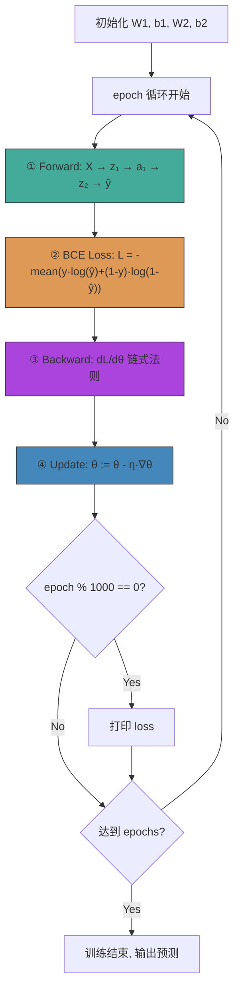

# `nn_toy.py` — 从零构建的微型前馈神经网络

## 1. Executive Overview

`nn_toy.py` 是一个**仅依赖 NumPy、从零手写的两层前馈神经网络**，用于学习 XOR（异或）问题。代码不借助 PyTorch/TensorFlow 等任何深度学习框架，把神经网络最核心的五个环节——**前向传播、激活函数、损失计算、反向传播、梯度下降**——完全暴露出来，非常适合初学者理解"一个神经网络到底在做什么"。

核心架构：

```
输入层 (2维) → 隐藏层 (4个神经元, sigmoid) → 输出层 (1维, sigmoid)
```

XOR 问题的巧妙之处：它在二维平面上无法用一条直线分开（线性不可分），因此**必须引入隐藏层和非线性激活**才能解决。这个 toy 代码正是通过 8000 轮训练，从随机参数开始学会 XOR 映射，训练结束后预测概率趋近于 0 或 1。

---

## 2. Key Concepts & Mathematics

### 2.1 层计算：`z = X @ W + b`

每一层都是一个**仿射变换**（线性变换 + 平移）：

```
z = X · W + b
```

其中：
- **X**: 输入矩阵，形状 `[N, d_in]`（N = 样本数，d_in = 输入维度）
- **W**: 权重矩阵，形状 `[d_in, d_out]`
- **b**: 偏置向量，形状 `[d_out]`（广播到 `[N, d_out]` 再相加）
- **z**: 该层预激活值，形状 `[N, d_out]`

> **为什么矩阵乘法是这个方向？** 因为我们约定每个样本是行向量，权重矩阵的每一列对应一个输出神经元。`X @ W` 中第 i 行第 j 列 = 样本 i 对所有输入分量加权求和送到神经元 j。

### 2.2 Sigmoid 激活函数

$$
\sigma(x) = \frac{1}{1 + e^{-x}}
$$

- 值域 `(0, 1)`，天然适合输出概率
- 非线性，使网络能够学习曲线边界
- 导数：$\sigma'(x) = \sigma(x)(1 - \sigma(x))$（代码中利用已算出的 sigmoid 输出来算导数，避免重复计算 `exp`）

### 2.3 二元交叉熵损失（Binary Cross-Entropy）

对二分类问题，每个样本的损失为：

$$
\mathcal{L}(\hat{y}, y) = -\big[ y \cdot \log(\hat{y}) + (1 - y) \cdot \log(1 - \hat{y}) \big]
$$

- $y \in \{0, 1\}$：真实标签
- $\hat{y} \in (0, 1)$：预测概率

取所有样本的平均作为最终 loss。**数值稳定性**：对 $\hat{y}$ 做 `clip(ε, 1-ε)` 防止 `log(0)`。

### 2.4 反向传播 — 链式法则

反向传播的目标：计算 loss 对每个可学习参数（W1, b1, W2, b2）的梯度 $\frac{\partial \mathcal{L}}{\partial \theta}$。

#### 输出层梯度（一个经典简化）

BCE + Sigmoid 的组合有一个漂亮的性质：

$$
\frac{\partial \mathcal{L}}{\partial z_{out}} = \hat{y} - y
$$

**推导**（以单个样本为例）：

$$
\begin{align}
\frac{\partial \mathcal{L}}{\partial \hat{y}} &= -\frac{y}{\hat{y}} + \frac{1-y}{1-\hat{y}} \\[4pt]
\frac{\partial \hat{y}}{\partial z_{out}} &= \sigma(z_{out})(1 - \sigma(z_{out})) = \hat{y}(1 - \hat{y}) \\[4pt]
\frac{\partial \mathcal{L}}{\partial z_{out}} &= \frac{\partial \mathcal{L}}{\partial \hat{y}} \cdot \frac{\partial \hat{y}}{\partial z_{out}} = \hat{y} - y
\end{align}
$$

这个简化减少了计算量，也避免了 sigmoid 导数在饱和区趋近于 0 的数值问题。

> 代码中除以 `n_samples` 是因为 loss 取了均值，所以梯度也要除以样本数。

#### 隐藏层梯度

从输出层往回传播（**反向**传播）：

$$
\begin{align}
\frac{\partial \mathcal{L}}{\partial W_2} &= A_{hidden}^T \cdot \frac{\partial \mathcal{L}}{\partial z_{out}} \\[4pt]
\frac{\partial \mathcal{L}}{\partial b_2} &= \sum \frac{\partial \mathcal{L}}{\partial z_{out}} \\[4pt]
\frac{\partial \mathcal{L}}{\partial A_{hidden}} &= \frac{\partial \mathcal{L}}{\partial z_{out}} \cdot W_2^T \\[4pt]
\frac{\partial \mathcal{L}}{\partial z_{hidden}} &= \frac{\partial \mathcal{L}}{\partial A_{hidden}} \odot \sigma'(z_{hidden}) \\[4pt]
\frac{\partial \mathcal{L}}{\partial W_1} &= X^T \cdot \frac{\partial \mathcal{L}}{\partial z_{hidden}} \\[4pt]
\frac{\partial \mathcal{L}}{\partial b_1} &= \sum \frac{\partial \mathcal{L}}{\partial z_{hidden}}
\end{align}
$$

### 2.5 梯度下降更新

$$
\theta := \theta - \eta \cdot \nabla_\theta \mathcal{L}
$$

其中 $\eta$ 是学习率（代码中用 `learning_rate`）。

### 2.6 为什么隐藏层使用随机初始化？

如果所有权重初始化为相同的值（比如全 0），每个隐藏层神经元在前向传播时输出相同，反向传播时接收相同的梯度，最终所有神经元学到的内容完全一样——这叫**对称性问题（symmetry breaking）**。随机初始化打破这种对称性，让不同神经元各自学习不同的特征。

---

## 3. Step-by-Step Code Walkthrough

### 3.1 激活函数

```python
def sigmoid(x: np.ndarray) -> np.ndarray:
    return 1.0 / (1.0 + np.exp(-x))
```

对输入数组逐元素应用 $\sigma(x) = \frac{1}{1+e^{-x}}$。NumPy 的向量化运算使得这一行代码就能处理任意形状的数组。

```python
def sigmoid_derivative(sigmoid_output: np.ndarray) -> np.ndarray:
    return sigmoid_output * (1.0 - sigmoid_output)
```

**关键设计决策**：这个函数接收的**不是**原始输入 x，而是已经算好的 `sigmoid(x)` 结果。这是因为 $\sigma'(x) = \sigma(x)(1-\sigma(x))$，前向传播时已经算出了 $\sigma(x)$，反向传播时直接用，避免重复计算 $e^{-x}$——算力节省是实打实的。

### 3.2 前向传播缓存

```python
@dataclass
class ForwardPass:
    x: np.ndarray
    hidden_z: np.ndarray      # 隐藏层预激活值
    hidden_a: np.ndarray      # 隐藏层激活后输出
    output_z: np.ndarray      # 输出层预激活值
    prediction: np.ndarray    # 最终预测概率
```

这是一个**纯数据容器**（data class），把前向传播中每一层的中间结果都保存下来，**反向传播时直接复用，不需要重新计算**。这是标准深度学习框架（如 PyTorch 的 `autograd` 图）的简化版本。

### 3.3 权重初始化

```python
def __init__(self, input_size=2, hidden_size=4, output_size=1, seed=42):
    rng = np.random.default_rng(seed)
    self.w1 = rng.normal(loc=0.0, scale=0.5, size=(input_size, hidden_size))
    self.b1 = np.zeros((1, hidden_size))
    self.w2 = rng.normal(loc=0.0, scale=0.5, size=(hidden_size, output_size))
    self.b2 = np.zeros((1, output_size))
```

| 参数 | 形状 | 含义 |
|------|------|------|
| `w1` | `[2, 4]` | 两个输入 → 四个隐藏神经元的权重 |
| `b1` | `[1, 4]` | 四个隐藏神经元的偏置 |
| `w2` | `[4, 1]` | 四个隐藏神经元 → 一个输出的权重 |
| `b2` | `[1, 1]` | 输出神经元的偏置 |

**几点值得注意**：
- 权重用 `scale=0.5` 的正态分布初始化——值偏小有助于训练初期稳定，避免 sigmoid 过饱和
- 偏置可以安全地初始化为 0（对称性主要靠权重打破）
- `b1` 和 `b2` 形状是 `[1, N]` 而非 `[N,]`，这是为了**广播（broadcasting）**：`[N_samples, N] + [1, N]` 自动扩展

### 3.4 前向传播

```python
def forward(self, x: np.ndarray) -> ForwardPass:
    hidden_z = x @ self.w1 + self.b1          # [N,  4] ← [N, 2] @ [2, 4] + [1, 4]
    hidden_a = sigmoid(hidden_z)              # [N,  4] ← sigmoid
    output_z = hidden_a @ self.w2 + self.b2   # [N,  1] ← [N, 4] @ [4, 1] + [1, 1]
    prediction = sigmoid(output_z)            # [N,  1] ← sigmoid
    return ForwardPass(x, hidden_z, hidden_a, output_z, prediction)
```

**数据流**：

```
X [N, 2]
  │  @ W1 [2, 4] + b1 [1, 4] ← 广播
  ▼
hidden_z [N, 4]
  │  sigmoid(z)
  ▼
hidden_a [N, 4]
  │  @ W2 [4, 1] + b2 [1, 1] ← 广播
  ▼
output_z [N, 1]
  │  sigmoid(z)
  ▼
prediction [N, 1]   ← 每个样本的概率 ∈ (0, 1)
```

**广播机制**：`b1` 形状 `[1, 4]` 自动沿 `axis=0` 复制到 `[N, 4]`，然后与 `[N, 4]` 的 `hidden_z` 逐元素相加——无需手动复制。

### 3.5 损失函数

```python
@staticmethod
def binary_cross_entropy(y_true: np.ndarray, y_pred: np.ndarray) -> float:
    epsilon = 1e-9
    y_pred = np.clip(y_pred, epsilon, 1.0 - epsilon)
    losses = -(y_true * np.log(y_pred) + (1.0 - y_true) * np.log(1.0 - y_pred))
    return float(np.mean(losses))
```

逐行解释：

| 代码 | 作用 |
|------|------|
| `np.clip(y_pred, ε, 1-ε)` | 将预测概率钳制在 `[1e-9, 1-1e-9]`，防止 `log(0) → -∞` |
| `y_true * np.log(y_pred)` | 真实标签为 1 时的损失分量（当 y=0 时此项为 0） |
| `(1 - y_true) * np.log(1 - y_pred)` | 真实标签为 0 时的损失分量（当 y=1 时此项为 0） |
| `np.mean(...)` | 对 N 个样本取平均 |

### 3.6 反向传播（核心）

```python
def backward(self, cache: ForwardPass, y_true: np.ndarray) -> dict[str, np.ndarray]:
    n_samples = y_true.shape[0]

    # 输出层梯度 — BCE+Sigmoid 的简化结果
    d_output_z = (cache.prediction - y_true) / n_samples
    d_w2 = cache.hidden_a.T @ d_output_z
    d_b2 = np.sum(d_output_z, axis=0, keepdims=True)

    # 隐藏层梯度 — 链式法则传播回去
    d_hidden_a = d_output_z @ self.w2.T
    d_hidden_z = d_hidden_a * sigmoid_derivative(cache.hidden_a)
    d_w1 = cache.x.T @ d_hidden_z
    d_b1 = np.sum(d_hidden_z, axis=0, keepdims=True)

    return {"w1": d_w1, "b1": d_b1, "w2": d_w2, "b2": d_b2}
```

**完整链式法则展开**：

#### 第一步：输出层

```python
d_output_z = (cache.prediction - y_true) / n_samples
```

这就是 $\frac{\partial \mathcal{L}}{\partial z_{out}} = \frac{\hat{y} - y}{N}$。除以 N 是因为 loss 取了均值。

```python
d_w2 = cache.hidden_a.T @ d_output_z
```

$$
\frac{\partial \mathcal{L}}{\partial W_2} = A_{hidden}^T \cdot \frac{\partial \mathcal{L}}{\partial z_{out}}
$$

**维度检查**：`hidden_a.T [4, N] @ d_output_z [N, 1] → [4, 1]`，恰好匹配 `W2` 的形状。矩阵乘法的物理意义：每个样本对梯度的贡献按隐藏层激活值加权求和。

```python
d_b2 = np.sum(d_output_z, axis=0, keepdims=True)
```

偏置梯度是 $\frac{\partial \mathcal{L}}{\partial z_{out}}$ 沿样本维度的求和，结果保留 `[1, 1]` 形状以匹配 `b2`。

#### 第二步：传播至隐藏层

```python
d_hidden_a = d_output_z @ self.w2.T
```

将输出层的梯度通过 W2 的转置"反向传递"回隐藏层激活：

$$
\frac{\partial \mathcal{L}}{\partial A_{hidden}} = \frac{\partial \mathcal{L}}{\partial z_{out}} \cdot W_2^T
$$

**维度**：`[N, 1] @ [1, 4] → [N, 4]`。对每个样本，将输出层梯度（标量）按 `W2` 的四个权重分配到四个隐藏神经元。

```python
d_hidden_z = d_hidden_a * sigmoid_derivative(cache.hidden_a)
```

穿越 sigmoid 函数的梯度：$\frac{\partial \mathcal{L}}{\partial z_{hidden}} = \frac{\partial \mathcal{L}}{\partial A_{hidden}} \odot \sigma'(z_{hidden})$

这里用的是逐元素乘法 `*`（Hadamard 积），因为 sigmoid 是逐元素操作，每个神经元的激活函数梯度只影响自己。

```python
d_w1 = cache.x.T @ d_hidden_z
d_b1 = np.sum(d_hidden_z, axis=0, keepdims=True)
```

与输出层同名操作完全对称：

- `d_w1`：`X.T [2, N] @ d_hidden_z [N, 4] → [2, 4]`，恰好匹配 `W1`
- `d_b1`：沿样本维度求和 → `[1, 4]`

### 3.7 参数更新

```python
def update(self, gradients: dict[str, np.ndarray], learning_rate: float) -> None:
    self.w1 -= learning_rate * gradients["w1"]
    self.b1 -= learning_rate * gradients["b1"]
    self.w2 -= learning_rate * gradients["w2"]
    self.b2 -= learning_rate * gradients["b2"]
```

标准的 SGD（随机梯度下降）更新规则。这里虽然叫 SGD，但实际上每次用全部 4 个样本做**批量梯度下降（Batch GD）**——没有抽取 mini-batch。

### 3.8 训练循环

```python
def train(self, x, y, epochs=10000, learning_rate=1.0, print_every=1000):
    for epoch in range(1, epochs + 1):
        cache = self.forward(x)                   # ① 前向
        loss = self.binary_cross_entropy(y, cache.prediction)  # ② 算 loss
        gradients = self.backward(cache, y)       # ③ 反向求梯度
        self.update(gradients, learning_rate)     # ④ 更新参数
```

**训练循环就是这四个步骤的反复迭代**，毫不夸张地说，这就是所有深度学习框架（PyTorch、JAX、TensorFlow）训练循环的本质骨架。

### 3.9 XOR 数据生成

```python
def make_xor_data():
    x = np.array([[0,0], [0,1], [1,0], [1,1]])
    y = np.array([[0], [1], [1], [0]])
    return x, y
```

| 输入 | 输出 |
|------|------|
| (0, 0) | 0 |
| (0, 1) | 1 |
| (1, 0) | 1 |
| (1, 1) | 0 |

XOR 是检验神经网络的经典试金石，因为**单层感知机（没有隐藏层）无法学习 XOR**。这需要非线性决策边界，正是隐藏层发挥作用的地方。

---

## 4. Architecture / Flow Diagram

### 4.1 网络架构图

```
                    ┌─────────── Hidden Layer (4 neurons) ───────────┐
                    │                                                │
  Input [N,2]       │    z₁ = X·W1+b1       a₁ = σ(z₁)              │    Output [N,1]
                    │                                                │
   x₁ ──────────────┼──→ [·w₁₁][·w₁₂][·w₁₃][·w₁₄] ──→ σ ───────────┼──→ [·w₂₁] ──→ σ ──→ ŷ
                    │         ×      ×      ×      ×                │       ×
   x₂ ──────────────┼──→ [·w₁₁][·w₁₂][·w₁₃][·w₁₄] ──→ σ ───────────┼──→ [·w₂₂]          (probability)
                    │         ×      ×      ×      ×                │       ×
                    │       +b₁₁   +b₁₂   +b₁₃   +b₁₄               │     +b₂₁
                    │                              ↓  ↓  ↓  ↓       │       ↓
                    │                          a₁₁ a₁₂ a₁₃ a₁₄      │      z₂₁ ──→ σ ──→ ŷ
                    └────────────────────────────────────────────────┘
```

### 4.2 训练循环 Mermaid 流程图



### 4.3 反向传播梯度流

```
    L (loss)
    │
    ├── ∂L/∂ŷ = -(y/ŷ) + (1-y)/(1-ŷ)        ← BCE 对概率的梯度
    │
    ▼
  z_out (输出预激活)
    │  ∂L/∂z_out = ŷ - y                     ← BCE+Sigmoid 简化 (除以 N)
    │
    ├── ∂L/∂W₂ = A_hiddenᵀ · ∂L/∂z_out       ← [4,N] @ [N,1] → [4,1]
    ├── ∂L/∂b₂ = Σ ∂L/∂z_out                  ← 按样本求和
    │
    ▼  ∂L/∂A_hidden = ∂L/∂z_out · W₂ᵀ        ← [N,1] @ [1,4] → [N,4]
    │
  A_hidden (隐藏层激活)
    │
    ▼  ∂L/∂z_hidden = ∂L/∂A_hidden ⊙ σ'(z_hidden)
    │                  ← 穿越 sigmoid，逐元素乘法
  z_hidden (隐藏预激活)
    │
    ├── ∂L/∂W₁ = Xᵀ · ∂L/∂z_hidden           ← [2,N] @ [N,4] → [2,4]
    └── ∂L/∂b₁ = Σ ∂L/∂z_hidden               ← 按样本求和
```

### 4.4 完整张量形状追踪

```
Step                Tensor              Shape
────────────────────────────────────────────────
Input               X                   [4, 2]     (4 samples, 2 features)
                    W1                  [2, 4]
                    b1                  [1, 4]
────────────────────────────────────────────────
Linear 1            z₁ = X@W1 + b1      [4, 4]     (broadcast +)
Activation 1        a₁ = σ(z₁)          [4, 4]
────────────────────────────────────────────────
                    W2                  [4, 1]
                    b2                  [1, 1]
────────────────────────────────────────────────
Linear 2            z₂ = a₁@W2 + b₂     [4, 1]
Activation 2        ŷ = σ(z₂)           [4, 1]
────────────────────────────────────────────────
Loss                L = BCE(y, ŷ)       scalar
────────────────────────────────────────────────
Grad output         ∂L/∂z₂              [4, 1]     (= (ŷ-y)/4)
Grad W2             ∂L/∂W₂              [4, 1]     (= a₁ᵀ @ ∂L/∂z₂)
Grad b2             ∂L/∂b₂              [1, 1]
Grad hidden act     ∂L/∂a₁              [4, 4]     (= ∂L/∂z₂ @ W2ᵀ)
Grad hidden z       ∂L/∂z₁              [4, 4]     (= ∂L/∂a₁ ⊙ σ'(z₁))
Grad W1             ∂L/∂W₁              [2, 4]     (= Xᵀ @ ∂L/∂z₁)
Grad b1             ∂L/∂b₁              [1, 4]
────────────────────────────────────────────────
Update              θ := θ - η·∇L       (SGD step)
```

---

## 5. Key Takeaways for Practitioners

1. **BCE + Sigmoid 的梯度简化是故意的，不是巧合**：大多数框架（PyTorch 的 `BCEWithLogitsLoss`、TensorFlow 的 `sigmoid_cross_entropy_with_logits`）都利用这个数值更稳定的简化形式，直接从 logits 计算 loss，而不是先过 sigmoid 再算 BCE。

2. **`keepdims=True` 的重要性**：偏置梯度 `sum(d_output_z, axis=0, keepdims=True)` 保留 `[1, N]` 形状而非 `[N,]`，这样广播减法 `b1 -= lr * d_b1` 才能正确工作。

3. **学习率设为 1.0**：对于一个只有 4 个样本的 toy 问题，这是个相当激进的学习率。实际深度学习任务的典型学习率是 `1e-3` 到 `1e-4`。

4. **`ForwardPass` 这个模式就是 PyTorch autograd 的本质**：PyTorch 在每次前向传播时构建计算图，每个张量记录了自己在图中做了什么操作。当调用 `.backward()` 时，它沿着图反向计算梯度——和这里的 `ForwardPass` + `backward(cache)` 模式一模一样，只是自动化了。
